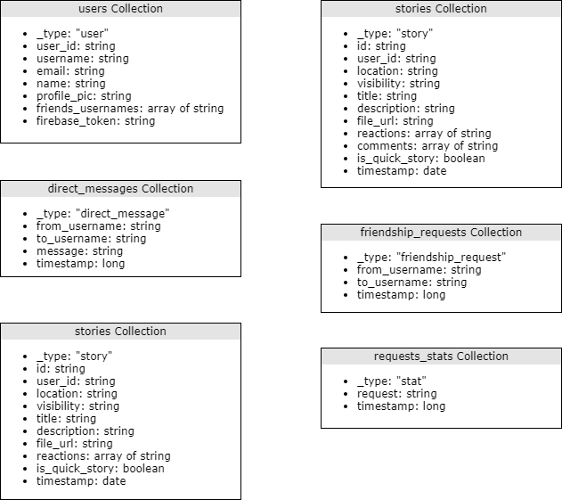

# App Server

## Tecnologías involucradas

El App Server se desarrolló en Python 3, utilizando Flask como librería para el servidor web y MongoDB para el manejo de base de datos.

Utiliza también el servicio Firebase Cloud Messaging para el envío mensajes de notificación y de chat entre usuarios a través de la nube.

## Arquitectura

### General

El proyecto esta estructurado en los siguientes paquetes:
 * /config : toda la información relacionada con configuración del AppServer, conexión con el Shared Server, configuración de Firebase, de MongoDB, etc
 * /docs : contiene los archivos de documentación del proyecto
 * /model : contiene las entidades de nuestro modelo y las entidades que viajan hacia/desde la base de datos.
 * /resources : contiene todos los recursos de nuestro servidor web
 * /test : contiene el conjunto de pruebas desarrolladas para evaluar el funcionamiento de nuestro código.

### Recursos

Se desarrollaron endpoints específicos para cada uno de los dominios de la aplicación bajo los siguientes grupos:

* Ping
  * ping_resource
* Users
  * user_resource
* Friendship
  * friendship_resource
  * friendship_request_resource
* Direct Messages
  * message_resource
* Firebase
  * user_resource (ya que el token de firebase es guardado en la entidad del usuario)
* Stories
  * story_resource
* Stats
  * stats_resource
  
#### Servicios generales

* Consulta de estado de conexión del servidor
* Alta, baja, modificación y consulta de usuarios
* Alta, baja, modificación y consulta de amistades
* Alta, baja y consulta de solicitudes de amistad
* Alta y consulta de mensajes
* Alta, baja modificación y consulta de historias
* Consulta de estadísticas

### Base de datos

La base de datos se diseñó en MongoDB. Se utilizó la librería 'pymongo' para el manejo de la misma en Python.

### Estrategia de testing

El testing del App Server se realizó utilizando el framework 'unittest'.

Los tests corren localmente, apuntando a la base de datos local. Se procura limpiar la base de datos en cada test para garantizar la independencia de las pruebas.

#### Pruebas Unitarias

Se desarrollaron pruebas unitarias en base a los servicios publicados mediante la interfaz REST. Se utilizó la librería Mock para lograr independencia de los módulos externos con los que se comunica nuestra aplicación como por ejemplo el Shared Server, la plataforma de Firebase Cloud Messaging o simular el paso del tiempo en los tests de estadísticas.

#### Pruebas de integración

Para evaluar el funcionamiento general se realizaron también pruebas de integración del App Server como un todo, es decir, sin utilizar mocks de ninguna dependencia.
